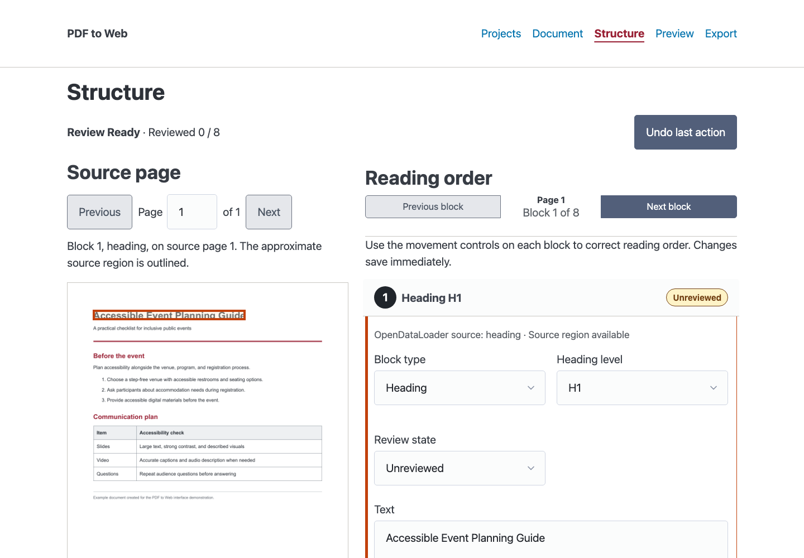

# PDF to Web

PDF to Web is a local-first conversion tool that turns PDF publications into a
reviewable normalized document, semantic HTML, Gutenberg block markup, and
WordPress WXR/XML. [OpenDataLoader PDF](https://github.com/opendataloader-project/opendataloader-pdf)
is the Apache-2.0-licensed extraction engine on which this project builds. PDF
to Web adds its own normalized document model, review workflow, source-aware
editing, validation, and web and WordPress exporters; it is not a fork of
OpenDataLoader. The normalized document remains independent of the extraction
engine and every export format. See [Third-party notices](THIRD_PARTY_NOTICES.md)
for the principal runtime and bundled dependencies.

Extraction uses deterministic local processing and never enables OpenDataLoader
hybrid or external AI processing. The completed Phase 2 foundation provides a
local FastAPI/PicoCSS structural-review application over the same normalized
document model and exporters used by the CLI. Phase 3A adds human accessibility
authoring and downloadable review reports without claiming automated WCAG
conformance.



[Watch the 54-second silent end-to-end walkthrough](docs/media/pdf-to-web-walkthrough.mp4)

## Development setup

macOS or Linux:

```sh
cd pdf-to-web
python3 -m venv .venv
. .venv/bin/activate
python -m pip install -e '.[test]'
npm install
pdf-to-web doctor
```

Windows PowerShell:

```powershell
cd pdf-to-web
py -3.12 -m venv .venv
.venv\Scripts\Activate.ps1
python -m pip install -e ".[test]"
npm install
pdf-to-web doctor
```

OpenDataLoader requires Python 3.10 or newer and Java 11 or newer. The doctor
command checks both and looks for common Homebrew Java installations when the
default `java` command is too old.

Poppler is a separate system dependency for source-page rendering; installing
the Python project does not install its `pdfinfo` and `pdftoppm` commands.
On macOS with [Homebrew](https://formulae.brew.sh/formula/poppler) already set up:

```sh
brew install poppler
command -v pdfinfo
command -v pdftoppm
pdftoppm -v
.venv/bin/pdf-to-web doctor
```

On Debian/Ubuntu, use `sudo apt-get install poppler-utils`. On Windows, install
Poppler through your approved package source and add its executable directory
to `PATH`; verify with `where.exe pdfinfo`, `where.exe pdftoppm`, and
`pdf-to-web doctor`. Respect any administrator or security prompt.

If Structure reports **Poppler pdftoppm was not found on the app’s PATH**,
finish setup, stop and relaunch PDF to Web, then reopen the same project. The
macOS launcher includes `/opt/homebrew/bin` and `/usr/local/bin` so standard
Homebrew installations work even with a minimal Finder/Terminal PATH. For a
custom installation, launch from a terminal whose PATH includes Poppler.
Moving the PDF or creating another project does not supply the renderer, and
project regeneration is unnecessary. **Retry source page** handles transient
failures; **Open source PDF** remains available for comparison.

Extracted image assets are different from rendered source pages. Existing
`review/source-pages/page-*.png` files can display even without Poppler, while
uncached pages need it. A supplemental-extraction error mentioning **Pillow**
concerns the Python image package, not Poppler; inspect that separate error
before installing anything or re-extracting a project.

Node.js 20.19 or newer and `npm install` are required only for the
WordPress Preview; Semantic Preview and the other Python workflows do not need
Node.js.

### Desktop launchers

After completing development setup once, macOS users can double-click
`Launch PDF to Web.command` in Finder. If macOS blocks the first launch,
Control-click the file, choose **Open**, and approve it. Windows users can
double-click `Launch PDF to Web.bat` after setup. Both launchers use the local
`.venv` and run the same `pdf-to-web serve` command documented below.

The launchers report missing setup without installing software. The macOS
launcher adds the standard Homebrew executable paths for its app process only.

### Platform support

The application is developed and manually tested on macOS. Its Python paths,
local configuration, browser startup, and native file chooser have Windows and
Linux implementations, and OpenDataLoader supports Windows when Java is on
`PATH`. Windows also requires Python 3.10+, Java 11+, and Poppler utilities on
`PATH`; Node.js is optional as described above.

Windows should currently be treated as **supported but not yet validated**:
the automated suite has not been run on a Windows host and there is not yet a
Windows CI job. Please report platform-specific installation or file-picker
issues in GitHub Issues.

## Extraction spike workflow

```sh
pdf-to-web project create /path/to/my-report
pdf-to-web import /path/to/report.pdf --project /path/to/my-report
pdf-to-web extract --project /path/to/my-report
pdf-to-web normalize --project /path/to/my-report
pdf-to-web export all --project /path/to/my-report
pdf-to-web validate-exports --project /path/to/my-report
pdf-to-web validate-export-corpus /path/to/projects --output /path/to/reports
```

Use `--profile wsuwp` with the Gutenberg or all export command to exercise the
WSUWP profile. Project-level profile, hero, section, and WordPress publication
defaults live in `project.json`.

`validate-exports` generates the complete publication set through the existing
exporters and writes `output/reports/export-validation.json` plus
`output/reports/export-validation.md`. The gate checks HTML structure, internal
anchors, Gutenberg block balance, local Gutenberg preview conversion, WXR
metadata and embedded content, and semantic content preservation across the
reviewed model and each output. External URLs are preserved syntactically; core
validation never depends on network access.
`validate-export-corpus` runs that gate for each immediate document-project
folder and generates a corpus-level JSON and Markdown result matrix.

WordPress exports distinguish local extracted assets from publishable media.
Configured HTTP(S) URLs generate normal image blocks, with attachment IDs only
when explicitly supplied. Unresolved meaningful images generate visible
replacement placeholders instead of broken URLs. Their extracted files and
metadata are written to `output/wordpress/assets/` and
`output/wordpress/reports/media-manifest.{json,md}` for later Media Library
mapping. Direct upload is intentionally outside the current scope.

On **Export**, first choose an **Image filename prefix** and select **Prepare
images ZIP and mapping CSV**. The default uses the document title; for example,
`my-report-` produces `my-report-image1.png`, `my-report-image2.png`,
etc. Original assets are unchanged. Names follow immutable extraction order and
remain stable when content is reordered, excluded or arranged into output pages.
The prefix persists with review state and supports **Undo last change**.

Export step 1 groups **Prepare images ZIP and mapping CSV** with **Undo last
change**. In step 2, each media file chooser and its matching/import button share
a row. Step 3 groups **Copy page title** and **Export reviewed document** in one
action row. These rows wrap on narrow screens. Primary actions that move the
export workflow forward are green; Undo and Copy are gray, and disabled actions
remain visibly disabled.

Download `output/wordpress/media-upload.zip` and
`output/wordpress/reports/media-mapping.csv` before exporting content. The ZIP
contains all included local image assets, including decorative images; excluded
content stays excluded, and repeated references share a file. Decorative images
do not need mapping rows. Missing local assets are reported in the media manifest.

Instead of entering every URL and attachment ID manually, use WordPress Tools >
Export to download a Media WXR/XML file after uploading the images, then choose
**Match WordPress media** on PDF to Web's Export screen. Exact filenames are
matched into `media-mapping.csv`; unmatched or duplicate filenames are left for
manual review rather than guessed. XML matching preserves current reviewed alt
text and captions, even if they changed after preparing the CSV.

Deleting and re-uploading unchanged WordPress images can assign new attachment
IDs while keeping their filenames and URLs. Matching reports these as awaiting
explicit refresh. Select **These are the same reviewed images; refresh existing
attachment IDs**, then match the same XML again. Only a unique exact filename
with the same saved URL can refresh; ambiguous, missing or different-URL matches
keep the current mapping and show their reason. Repeating current matches reports
them as already current without another saved revision. XML cannot establish that
image bytes are unchanged. Changed source images require fresh alternatives and
linked-description review; this mapping operation never approves pending content.
Use manual CSV mapping to explicitly select different URLs.
The result leads with **Mappings updated**, not filename matches. If confirmation
was not selected, it explicitly says the attachment IDs were not refreshed and
repeats that warning at the focused Export readiness section. Filename matches
only establish names; Already current means no change was needed. Choose the XML
first, then select refresh: a new file selection clears the checkbox and displays
a notice when it clears an existing confirmation.

Mapping instructions appear as ordered steps. Matching focuses Export readiness
with a link to a result table
with prominent totals and lists every unmatched or ambiguous image's filename,
description, source page and link to its Structure block. Download the current
CSV from that result to finish any remaining mappings manually.

Alternatively, enter each full WordPress media URL and optional attachment ID in
the CSV and import it under **Map images manually with a CSV**. Stable `block_id`
values correlate attachments with source figures even when WordPress renames
files. After mapping, **Export and copy content** generates the HTML, Gutenberg
or WXR with mapped URLs. Unresolved meaningful images remain visible WordPress
upload placeholders. Mapping changes clear stale copy/download results until
export is regenerated. Media routing changes preserve content approval; source, alt, caption and
authored-description edits require fresh review. Counts, review links and the
Export button update immediately after XML/CSV mapping and Undo. Earlier approvals
lost to media-only changes can be restored explicitly from retained history as
described below. A failed import leaves saved review state unchanged. Standalone semantic HTML copies unmapped local images to
its `assets/` folder with the same meaningful names and uses mapped URLs when
available. Changing the prefix after uploading requires manual filename matching
or a new upload. This workflow needs no WordPress credentials in PDF to Web.

Authenticated WordPress media upload and direct draft publishing are deferred
in `docs/FUTURE_FEATURES.md`.

## Local review application

Launch the local review interface:

```sh
pdf-to-web serve
```

The Projects screen can create a project, import its source PDF, run extraction
and normalization, open an existing project, and reopen recent projects. Choose
**Folder I choose** and **Choose destination folder** to use that exact folder as
the project root. The name does not add another directory below it. **Default
location** creates a named folder under `~/Documents/PDF to Web Projects`; the
full destination is shown before you choose the input PDF. The input PDF's folder
and project folder are separate choices. The original is preserved and a copy
is placed in `source/` (a PDF already there is used in place).

Each project contains its own `project.json`, source copy, extraction/assets,
review/history/source-page cache and exports. The full working path appears on
every workflow page and in Recent projects. Existing loose files are preserved,
but an existing project or conflicting `extraction`, `review` or `output` entry
is rejected. An existing `source` folder may contain only regular PDF files;
filename collisions use a suffix without overwriting. Picker cancellation
creates no files. A later conversion failure retains the partial project at its
reported destination and leaves the previous project open. Reopen the retained
folder to inspect its incomplete status; correct the error, use the existing CLI
to import the PDF if its source copy is missing, then finish extraction and
normalization before reviewing. No existing projects
are moved. Global Recent projects preferences remain in the application config
directory described below. A failure to update that list displays a warning;
the saved project can still be opened directly. Choosing a folder does not install
the PDF renderer.

The command prints
and opens a one-use bootstrap URL, binds only to `127.0.0.1`, and keeps all
project data local. Use `--project /path/to/my-report` to open a known project at
startup or `--no-browser` to print the URL without opening it automatically.
Docker is not required to run, review, preview, or export a project.

Chrome, Safari, Firefox, and Edge are supported for the localhost review app.
Normal startup opens the one-use `/bootstrap/...` URL in the system default
browser, sets the local session cookie, and redirects to `http://127.0.0.1:8765/`.
With `--no-browser`, open the clearly printed bootstrap URL in the browser you
want to test.

Recent-project configuration contains only project title, canonical local path,
and last-opened timestamp. On macOS it is stored at
`~/Library/Application Support/PDF to Web/recent-projects.json`; Windows uses
`%LOCALAPPDATA%/PDF to Web/recent-projects.json`, and Linux uses
`$XDG_CONFIG_HOME/pdf-to-web/recent-projects.json` (falling back to
`~/.config/pdf-to-web`). Set `PDF_TO_WEB_CONFIG_DIR` to override the directory.
The app does not scan the filesystem for projects.

The Semantic HTML preview uses only Python dependencies. The optional WordPress
Preview additionally requires Node.js 20.19 or newer and the local packages
installed by `npm install`; it never requires WordPress, PHP, MySQL, Docker, or
an external service. See `docs/GUTENBERG_PREVIEW.md` for its compatibility and
security boundaries.

The original document filename appears above each workflow screen and in the
browser tab title. Button groups have spacing, and small text links below
Previous/Next filter reading order to all blocks, approved blocks, blocks needing
review, or excluded blocks. Each filter includes its current count in parentheses;
the visible/total block count shares that line when space permits and wraps on
narrow screens. The active link is emphasized and selection persists
when the screen reloads. A direct finding link reveals and focuses its block even
when filtered out. Saving block content, link text or review state returns to that
block below the sticky toolbar. Nested link edits return to their owning list;
if the saved block no longer matches the active filter, All opens to keep it
visible. Corrections opened from Accessibility still return to the finding.
Arrange Pages keeps **Continue to Preview** separate from the
four arrangement actions, aligned to the right. Preview's top and bottom
**Continue to Export** buttons also align to the right, with space between the
Semantic HTML and WordPress Preview mode buttons.

Final workflow actions align to the right throughout Document, Structure,
Accessibility, Arrange Pages, Preview and Export, including the green completion
handoffs and page/document export actions. Action rows wrap on narrow screens.
A floating **Back to top** button appears at the lower right on every app screen
after scrolling down. It returns to the top and focuses the application header
for keyboard navigation, without animation, navigation or changes to unsaved edits.

Accessibility findings identify their source page and current Reading order block
number, including the owning list for nested-link findings. Open block controls
align to the right; numbering follows reordering and Undo and includes excluded
blocks in the same numbering used by Structure.

Visual-description cards show current text-equivalent readiness instead of an
unconditional warning. Short alt text plus either a long description or adjacent
equivalent is required for a complex image; adjacent text is optional when a long
description is present, and recovered source text is always optional. The long
description or its adjacent-text fallback is included beside the image in exports. **Reviewed**
explicitly approves the linked image too. **Not applicable** records that this
description is unnecessary without excluding the image. Saving unchanged text
preserves image approval. All changes support Undo. Structure's green completion
message requires resolved block decisions and reviewed or inapplicable descriptions.
Filled text alone does not complete a description: **Reclassified** still needs a
manual **Reviewed** or **Not applicable** decision. Document, Structure,
Accessibility and Export use this same distinction. Export findings link directly
to the affected block or description, with its source page and readable context.

For older approved lists containing pending nested items, reopening can preserve
the existing approval only when a local retained snapshot proves the exact same
content, project, review session and approval timestamp, with no newer conflicting
history or child edit. The versioned evidence records the snapshot filename and
SHA-256 without approving children or changing the original decision timestamp.
Without that proof, the list appears as needing review with an explanation that
the earlier approval cannot be verified. Review it and approve the saved content;
Undo restores the preceding decision and its evidence.

Each primary block editor offers **Save and approve** beside its ordinary save
button. It saves the displayed fields and explicitly approves the resulting block
in one operation, with one Undo step. This includes recovering retained list text
as one item; it does not infer nested steps. Invalid list structure or an image
without alt text or a decorative decision prevents the operation and shows an
inline explanation while retaining your entered fields. Ordinary Save still
requires fresh review after content changes. Approve uses saved content; when
there are unsaved fields it directs you to Save and approve. Save or undo edits
in other editors first so approval cannot discard them. Image editors display alt,
caption, every explicitly associated long/adjacent description and current review
state together. Their **Save and approve** action approves exactly that image and
its displayed descriptions in one Undo revision. Missing text, ambiguous/missing
associations or a stale project snapshot reject the entire action. Existing pending
descriptions are never bulk-approved merely by opening or saving a project.
Ordinary image Save keeps edited content awaiting review; later material edits
invalidate current approval. A long description is sufficient without adjacent
text. Adjacent text is authored text, not a reference to an existing instruction
block. Linked descriptions have one editor inside their Reading order image;
there is no extra description approval stage. An image with a pending description
appears in **Needing review**, even when an older image-only approval is saved.
**Description use** allows an explicit **No separate description needed** or
exclusion decision in the same Save and approve action. Optional classification,
recovered source text and reviewer notes remain editable there. Standalone or
ambiguous visual records retain their separate editor. Affected output-page review
remains separate.

On **Accessibility**, unresolved document findings appear first. **Bulk review**
is optional and starts collapsed, showing **Pending only** records when opened.
Use **Show records** to inspect **Completed** or **All records**; approved,
excluded and not-applicable records remain available for explicit changes.
Visible status pills use green for Approved/Reviewed, amber for pending states
and gray for Excluded/Not applicable, with text identifying the actual state.
The visible saved-record count can include both an image and its description;
it is not added to the overall task count. Groups use classification. Use
**Classification filter**, per-row checkboxes or **Select all visible records**,
then **Review state options** and **Apply**. Inspect the displayed scope/count and
confirm it explicitly. Changing classification or Show records clears selection
and any unconfirmed batch. Select all includes only the current visible scope. Block approvals,
description reviews and accessibility decisions have separate permitted states;
mixed record types cannot be changed in one batch. Image-block approval also
reviews its associated descriptions shown in that row. Server validation checks
the selected IDs, visible scope, project snapshot, permissions and required text.
Any invalid item rejects the entire batch with its exact reason; one Undo restores
a successful batch. No actual user approvals are made automatically.

Document shows review progress and **Review structure** at the top, with one set
of counts. **Pending** counts remaining block and description review tasks, with
each kind shown separately. A pending linked description is included in its
image's task, rather than counted again. For example, 54 blocks with five images
awaiting description review show **49 blocks reviewed**, **5 image reviews** and
**Pending 5 review tasks**, with the five included description reviews explained
separately. Standalone descriptions add their own tasks. **Total 54 blocks** still
counts document blocks. The same
task summary appears in Structure, Accessibility, Arrange Pages, Preview and
Export. Once block decisions and required descriptions are resolved, it offers
the same green **Continue to Accessibility** handoff as Structure. Remaining
Accessibility findings are reviewed there; an empty diagnostic count does not
produce a yellow warning. Unresolved extraction diagnostics appear inside this
same summary, with the recorded cause, publication impact and links to the
affected block or description. A diagnostic concerning one of 54 pending block
reviews does not make 55 review tasks. Checks without a block target explain
their source-page or document scope and offer the original PDF and Accessibility
decision link. Missing targets are identified rather than replaced with guessed
links. Manual approval or exclusion resolves historical block-review notes;
Undo restores them, and resolved notes remain in Accessibility history.
Metadata labels are larger and bold above their values.

Description links open the exact editor and keep a visible selection outline and
**Selected description for review** marker. Each editor shows status once, source
context, the reason review is needed and the next action. Reclassified text needs
a manual decision; a saved timestamp alone does not prove earlier approval.
Only an actual edit invalidating a recorded Reviewed decision adds a changed
since Reviewed reason and the affected field names. Fresh review clears that
reason; save/reopen and Undo preserve it. These optional review annotations use
the existing stored document and do not migrate or approve existing data.

Field labels are consistently bold, including generated controls; values and help
remain ordinary weight. Export has one readiness list per target, Arrange Pages
labels its separate Structure and Page decisions, and repeated status/guidance is
removed. Title-export details remain available in **How the title is exported**.
Preview retains forward actions at the top and bottom of its long content.

Structure gives **Image description drafts** a distinct heading and outlined
section. **Open drafting tools (optional)** keeps its longer tools collapsed;
**Draft image descriptions** links beside image alternatives and in Accessibility
open and focus that workflow. **Longer image descriptions** also stays collapsed
so Source page and Reading order stay in view. The description summary
shows how many need review; finding links expand and focus the relevant card.
The section explains when to add a longer description and when to choose
**Not applicable** because short alt text is sufficient. Extraction details are
collapsed under **Why these images appear here**.
Extraction flags pages with at least five retained images or assets as possible
complex visuals. This heuristic requires human classification; a saved image
long description also creates a description record. All images remain in Reading
order, and completed descriptions remain available for editing and export.
Manual response instructions use four ordered steps. Approved blocks have a
disabled gray Approve button until an edit or Needs review action requires review
again. **Saved review history** contains Undo, including earlier sessions' saved
changes. A compact gray **Undo last saved change** button is also available in
the sticky Reading order toolbar while editing blocks. Both restore the most
recent saved project change and are disabled when no revision snapshots remain.
Undo keeps the selected block in view when that block remains in the restored
document. Unsaved typing is not a saved revision.

Historical extraction block-review notes collapse under **Resolved extraction
note** after their referenced blocks are approved or excluded. Other Accessibility
findings can still need review. URL-as-link-text warnings link to Structure, where
**Link text** edits preserve the destination and rich formatting; edits require
review again. Link-label edits with footnote offsets are held for structural
review rather than changing citation positions silently.

Reload keeps the selected reading-order block. Changing the filter selects the
next matching block (or the previous match) when necessary; an empty filter
shows a contextual explanation and **Show all blocks** link beside the disabled
navigation in the sticky toolbar. An empty Needing review filter says no items
are left in that filter; other description or Accessibility tasks may remain.
Recovery restores All and focuses the remembered block (or the first available
block) without reloading or discarding unsaved typing. Filters do not switch
automatically when the last matching block is approved.
When saved evidence shows an approved block changed, Structure and Accessibility
explain why fresh approval is needed. Never-approved blocks keep their ordinary
review status. Undo restores both the content and its approval reason.

In Export, **My WordPress template supplies the page title (H1)** defaults to on.
Copy the displayed page title into WordPress's title field, then paste the generated
body or Gutenberg blocks. Semantic HTML provides both a standalone page with one
H1 and a separate `.body.html` without the title heading; only the body gets the
copy action in this mode. Gutenberg and WXR omit the title heading. **Body headings**
defaults to H2 sections; choose nested headings to retain hierarchy without skipped
levels. Settings persist in the review document and support Undo. Source heading
IDs, text, provenance and review decisions are retained. Legacy CLI exports keep
their title unless template mode was saved, and all publication heading projections
limit title H1s to one. The page template must supply its own single H1.

Reviewed content is stored in `review/current.json`; immutable normalized input
remains in `extraction/normalized/document.json`, and revision snapshots are
kept under `review/revisions/`. Files under `extraction/raw/` are never changed
by review operations. See `docs/PHASE2_REVIEW_APP.md` for the architecture,
security model, and current limits. The completion evidence and remaining
external acceptance checks are recorded in `docs/PHASE2_CLOSEOUT.md`.

Accessibility shows three separate scopes: block/image approvals, document
accessibility findings, and automated HTML checks. Completed content approvals
can coexist with unresolved human judgments such as visible URLs used as link
labels. Fix a label in the linked Structure editor, or record a justified decision
where allowed. Zero axe issues or incomplete checks do not resolve these findings.
Reviewed document decisions and resolved extraction notes remain in collapsed
history; neither is presented as pending work.

Accessibility automatically runs bundled axe-core 4.13.0 against the saved
semantic HTML snapshot when the screen opens. The iframe snapshot token must
match the displayed document. A changed snapshot prevents scanning and asks you
to reload; completion stays hidden. Successful results show the saved revision
and scan time. Reload after edits to scan again. WCAG 2.2 A/AA findings and uncertain checks
appear separately from document review, with links to affected Structure blocks
where available. No generate button, account, API key, Node runtime or external
request is needed for this browser scan. Reopening or refreshing Accessibility
checks the latest edits. Summary and finding tables emphasize rule and
affected-element counts. **View tested rules** opens a compact dialog, initially
showing the passed rules. Filter by result to see each rule's name, ID, purpose,
element count, WCAG criteria and guidance. Not-applicable rules found no matching
content; passed rule counts are not counts of WCAG success criteria. The dialog
uses the current scan and does not change review decisions.
Results are for the semantic document at desktop width; individual arranged pages,
final WordPress styling/plugins and human assistive
technology testing remain separate. CLI archival reports contain document review,
not browser axe results. To update the bundled engine, install the pinned npm
package and copy `axe.min.js` and `LICENSE` into the package's static directory.

Accessibility's **Open block** buttons carry a return to the originating finding.
Saving an edit or review action on that block returns to Accessibility and reruns
the HTML scan. Ordinary Structure edits stay in Structure. Label edits still need
block review; approving that block from the same return link also returns to the
issue list. Resolved extraction notes are collapsed under a history heading and
require no action. Save decision buttons use a compact width. Once document
findings are resolved and the current scan has neither detected issues nor
uncertain checks, a green **Continue to Arrange Pages** button appears at the bottom.

Arranged semantic page previews use the retained local images even when WordPress
URLs have been mapped. Arrange Pages' Undo is gray. Preview offers green
**Continue to Export** buttons above and below the preview. Export shows only
outstanding readiness checks and extraction diagnostics, lists unmapped images,
and confirms **Copied** beside Copy page title. Unresolved images still need
WordPress URL mapping; content WXR import is optional and does not
replace Media XML/CSV mapping when pasting Gutenberg.

Whole-list text edits preserve existing item IDs, source metadata, nested content,
exclusions and links when editing their labels. Unchanged list saves preserve
review decisions and rich formatting. Dedicated link-label edits update the parent
list editor too, so a later list save cannot restore an old label. Source PDF
annotations can recover a visible URL damaged only by missing or added hyphens;
the PDF supplies the destination, while the extracted words remain unchanged.

If a list retains text but has no items, Structure displays that text and the
reason it needs recovery. **Save block** recovers the displayed text as one item;
it does not infer nested steps from indentation. Unchanged-text conversion to
List also preserves one item, including existing links and formatting. Review
the result before approving it. Blank saves are rejected, and publication stays
blocked until the structure is recovered and reviewed. Preview serializers keep
the retained content visible. Existing projects are not automatically repaired;
Undo restores the prior state.

List source outlines include recorded regions for nested text, including
paragraphs. If an element has no recorded region, the source status explains
that coverage is partial; unoutlined text may still be present in the block.
No source coordinates are invented.

The Accessibility screen derives review items from the current reviewed
document, including incomplete structural decisions, image alternatives,
complex-visual text equivalents, table semantics, heading hierarchy, link
purpose, unknown content, and extraction diagnostics. Reviewer decisions and
notes are stored in `review/current.json`. Results appear immediately on the
Accessibility screen; extraction diagnostics link to affected blocks and show
their current status. Structure shows Reviewed (approved), Pending (unreviewed
or needs review), and Excluded counts. Excluded content remains recoverable.
For archival reports, generate
`output/reports/accessibility-review.html` and `.json` with:

```sh
pdf-to-web export accessibility --project /path/to/my-report
```

These reports document human review. They do not certify WCAG conformance.

**Structure** shows “Structure review complete” when every block is approved
or excluded, with required descriptions reviewed or inapplicable, and offers
**Continue to Accessibility**. Pending blocks or descriptions keep the message
hidden. Final approval brings the message into view; Undo
or a new pending review decision removes it. This completes block review, while
Accessibility remains a separate step.

Structure also offers optional **Image description drafts**. Select images,
confirm ambiguous image associations, save the provider choice per project,
generate through an existing local Ollama
vision model or an explicitly authorized paid OpenAI request, or export a manual
request ZIP for your chosen tool. **Export pending images ZIP** includes images
needing drafts without individual selection; the toolbar shows selected and pending
counts and brings the download link into view. Beside the ZIP controls,
**Copy instructions for Codex/ChatGPT**
copies a ready-to-use prompt: attach the downloaded ZIP, paste the instructions,
validate and import the returned `response-template.json`, then review each image.
Copying preserves unsaved edits. If clipboard copying fails, selectable instructions
appear for manual copying. The request ZIP is saved in the
current project's `output/image-drafts/` folder, including explicitly chosen
project roots. The saved full path appears beside its browser download link.
Names contain the project title, `image-drafting-request`, UTC time and a unique
suffix; repeated exports retain earlier packages. Completed ZIPs appear atomically
and failed writes preserve earlier packages. This drafting exchange is separate
from publication exports and WordPress's `media-upload.zip`. Cancel controls appear only for
active requests. Validate and import responses to fill empty alt, caption and long-description
fields directly. Existing text is preserved; use Apply to replace it deliberately.
Long descriptions are editable beside the image and retained through exports.
Their image-description cards show the associated image and share its short alt
text. Saving a visual review confirms in place and retains keyboard focus.
Structure places **Needs review**, **Exclude**, and **Approve** above each block
header and source details, in yellow, red, and green respectively.
Use **Fill empty fields from existing drafts** for previously imported drafts.
Null response fields leave existing content unchanged. Review, reject, retry and
Undo remain available; populated images still need human approval. No key or network access is needed for manual
exchange. See [workflow, providers and exchange schema](docs/IMAGE_DESCRIPTION_DRAFTS.md)
and [acceptance evidence](docs/IMAGE_DESCRIPTION_DRAFTS_ACCEPTANCE.md).

**Merge next** joins adjacent matching text blocks; it does not combine list
containers or convert mixed headings/paragraphs into one list. Unsupported
controls are disabled with an explanation, and failed actions show feedback
beside the block. Linked, formatted, nested and excluded content is protected
from merges that would discard it. Supported text merges preserve footnote
references and backlinks, retain source pages, require fresh approval and support
Undo. A mixed-block list conversion needs an explicit item/nesting design rather
than a bulk type-change workaround.

Publication exports require current manual approval of included source blocks and
visual descriptions. Arranged-page exports also require approval of each exported
page. Changes to saved content return its review owner to Needs review; save the
changes first, then approve the saved content. Editing a previously Reviewed
description requires a fresh Reviewed decision. Undo preserves its saved snapshot
when either document or project persistence fails, allowing a retry.

Import, Populate and Refresh draft actions ask you to save or undo unsaved
Structure edits before replacing the screen. Completed media CSVs associate
WordPress URLs and attachment IDs without replacing current alt text or captions.
Routing-only media matching preserves existing content review decisions and dates;
changing the source image, alt, caption or authored description still requires
review. Mapping changes invalidate older generated publications, so export fresh
content after matching. The saved document owns mapping state; Undo followed by
the same Media XML can re-match filenames even if the generated CSV still contains
older URLs. Existing document mappings take precedence over stale CSV reports.

After matching media, Export always moves keyboard focus and scrolls to
**Export readiness**, which stays visible when ready or blocked. The result
links back to detailed matching feedback, including unmatched or ambiguous images.
**Export reviewed document** and **Copy content** also bring readiness into view;
its Continue link returns to the content controls. The export button keeps an
adjacent explanation and a **View Export readiness** link.
Export shows a busy state, prevents repeat requests and locks media mutations
until it finishes. Failures remain visible and allow retry. Copy page title only
changes the clipboard; it preserves readiness, errors and generated-file feedback.
The complete local fixture journey tests images ZIP/CSV, Media XML matching,
WXR/XML + WSUWP + Page, title copying, generated downloads and artifact contents.

If an older media match cleared existing approvals, **Preview recorded approvals**
appears at Export readiness when retained history proves a mapping-only change.
It lists the exact eligible images and their original approval dates. **Confirm
restore N recorded approvals** restores those recorded decisions in one saved
change, keeping current media mappings and newer review decisions. Preview is
read-only; reopening never silently approves pending content. A changed project,
selection or history invalidates confirmation. Missing or nonconsecutive history,
ambiguous identities, manual pending decisions and genuine edits (even if later
reverted) remain for review. **Undo last change** restores the pending states;
conservative history verification may then require manual review again. No image
re-upload is needed. The confirmation explains this limit before restoring;
its Confirm button also exposes the warning to screen readers. Historical source
identities and recorded content are checked;
history does not independently establish earlier image-file bytes.

**Help** is available from every screen, including before project selection.
Contextual links open the exact explanation in a separate tab so unsaved fields
stay open. Background details about project files, review counts, image descriptions,
bulk review, HTML checks, media, preview appearance, title exports and acceptance
limits live there. Required errors, current states, exact review links and useful
long-page actions remain on their workflow screens.
New list items receive new identities; retained items keep their links, source
provenance and list start after reordering. Editing a footnote source body updates
its exported text while retaining note IDs, markers and backlinks. Ambiguous
changes involving repeated, nested or excluded items require individual edits. Nested headings are the default; an explicitly saved H2 sections
choice remains available.

Generated publication downloads and clipboard reads must match the current saved
document and export settings. Pending, changed, unstamped or outdated publications
are blocked; review and regenerate them. A rejected stale copy clears outdated
results and readiness counts, brings **Reload Export** into view and keeps the
clipboard unchanged. Reload checks current reviews before you generate fresh content. Existing files remain on disk. Internal
previews, accessibility reports, and media/draft exchange preparation remain
available during review. Validation reports fail without generating publication
files when review is incomplete.

**Arrange Pages** (previously Output Pages) is optional: a long document can stay on one web page using
**Preview** and **Export** directly. The workspace builds independently previewable Pages or
Articles from one reviewed document. Inspect heading-based grouping suggestions,
apply an arrangement, move whole content blocks, split or merge pages, edit
metadata and internal Page parents, set contents order, and Undo changes. Page
arrangements persist with the reviewed document. Unassigned content and invalid
arrangements remain visible and block page exports.
Use **Include unassigned content in this page** to recover missing assignments,
or **Keep everything on one page** to replace the arrangement without editing
content. Both support Undo. The arrangement outline is collapsed until needed.

Export one page or the complete ZIP package with HTML, Gutenberg, WXR, media,
contents, review findings, a versioned manifest and manual import instructions.
The CLI equivalent is `pdf-to-web export pages --project /path/to/project`.
Existing single-document exports retain their behavior. See
[Phase 3B workflow and schema](docs/PHASE3B_OUTPUT_PAGES.md) and the
[acceptance ledger](docs/PHASE3B_ACCEPTANCE.md). WordPress media upload,
permalink replacement and absent parent assignments remain manual.

Run tests without third-party test tooling:

```sh
python -m unittest discover -s tests -v
```

On macOS, path-sensitive fixture checks may distinguish `/var` from `/private/var`.
Use the canonical temporary directory for those checks:

```sh
TMPDIR=/private/tmp python -m unittest discover -s tests -v
```

Run the extraction spike corpus through both deterministic modes:

```sh
pdf-to-web spike sample_files --output sample_runs
```

The corpus report assigns one readiness state to every normalized result:

- `review_ready`: structurally exportable, with only advisory issues.
- `needs_review`: exportable, but a human must resolve material extraction or
  complex-visual issues.
- `conversion_blocked`: semantic HTML remains available for diagnosis, while
  Gutenberg and WXR generation are withheld.

Generate the repeatable local WordPress fixture set with:

```sh
pdf-to-web wordpress-fixtures --output build/wordpress-fixtures
```

The Docker and block-editor procedure is documented in
`tools/wordpress-roundtrip/README.md`.

The source PDFs remain unchanged. Each timestamped run contains separate
self-contained projects for heuristic and structure-tree extraction, plus JSON
and CSV comparison summaries. `sample_files/` and `sample_runs/` are ignored by
Git because source publications may contain internal or copyrighted material.

## Current boundary

Proposed source-recovery workflows and observed review edge cases are tracked
in [Future Features](docs/FUTURE_FEATURES.md). The backlog distinguishes missing
text from nested text whose source outline is incomplete; it does not imply
these features or corrections are already implemented.

Phase 2 structural review and Phase 3A accessibility authoring are complete.
The application does not include OCR remediation, a spreadsheet-like table
editor, media sideloading, direct publishing, or
a claim of automated WCAG conformance. The Phase 1B fixtures have been imported,
edited, saved, and reopened in an isolated local WordPress instance. Production
WSUWP compatibility still requires the exact deployed WSU block versions.

## License

PDF to Web is released under the [Apache License 2.0](LICENSE). See
[NOTICE](NOTICE) and [Third-party notices](THIRD_PARTY_NOTICES.md) for
attribution information.
